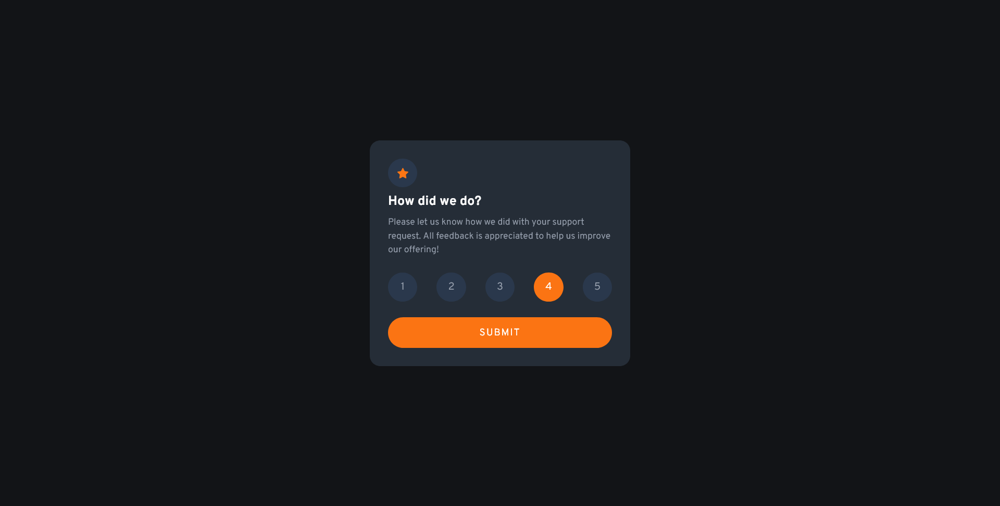

# Frontend Mentor - Interactive rating component

This is my solution to the [Interactive rating component](https://www.frontendmentor.io/challenges/interactive-rating-component-koxpeBUmI).

## Table of contents

- [Frontend Mentor - Interactive rating component](#frontend-mentor---interactive-rating-component)
  - [Table of contents](#table-of-contents)
  - [Overview](#overview)
    - [The challenge](#the-challenge)
    - [Screenshot](#screenshot)
    - [Links](#links)
  - [My process](#my-process)
    - [Built with](#built-with)
    - [What I learned](#what-i-learned)
  - [Author](#author)

## Overview

### The challenge

Users should be able to:

- Select and submit a number rating
- See the "Thank you" card state after submitting a rating
- See hover and focus states for all interactive elements on the page

### Screenshot



### Links

- Solution URL: (https://www.frontendmentor.io/solutions/interactive-rating-component-using-react-tailwind-typescript-ip_Z4xJN1K)
- Live Site URL: (https://juliflorezg.github.io/rating_component/)

## My process

- I created this project using the create-react-app tool for creating the overall react app, I built components for the Rating card and the Thank you message as well as a helper component for wrapping those two. I used tailwindCSS for the styling, and beyond that I used the forwardRef provided by react to manipulate the inner html elements inside a component (this was necessary to add the animation provided by the formik/autoanimate library). For the state I used Context and statically typed it with TypeScript.

### Built with

- tailwindCSS
- formik/autoanimate
- Mobile-first workflow
- [React](https://reactjs.org/) - JS library
- React hooks (useContext, useState, useRef)
- TypeScript

### What I learned

Using formik/autoanimate to animate components as they appear/disappear from the UI, for this I had to implement useRef to 'manipulate' HTML elements

```tsx
const parent = useRef<HTMLDivElement>(null)

useEffect(() => {
  parent.current && autoAnimate(parent.current)
}, [ctx, parent])

return (
  <Card maxWidth="400px" ref={parent}>
    {ctx.isMessageVisible ? <ThankYou /> : <Rating />}
  </Card>
)
```

For that to work I used the forwardRef method provided by react on Card component. Also the typing for forwardRef is a bit weird (it's a generic that accepts first the type for the ref AND THEN the type for the props object, while the component receives those two params in the opposite order):

```js
const Card = React.forwardRef<HTMLDivElement, Props>((props, ref) => {
  const [cssClasses, setCssClasses] = useState('')
  useEffect(() => {
    setCssClasses(`max-w-[${props.maxWidth}] p-6 bg-dark-blue rounded-2xl sm:p-7`)
  }, [props.maxWidth])

  return (
    <div className={cssClasses} ref={ref}>
      {props.children}
    </div>
  )
})
```

## Author

- Frontend Mentor - [@juliflorezg](https://www.frontendmentor.io/profile/juliflorezg)
- Github - [@juliflorezg](https://github.com/juliflorezg)
- Linkedin - https://www.linkedin.com/in/julian-florezg/
